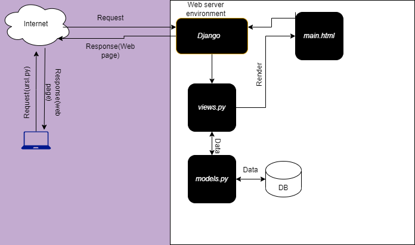
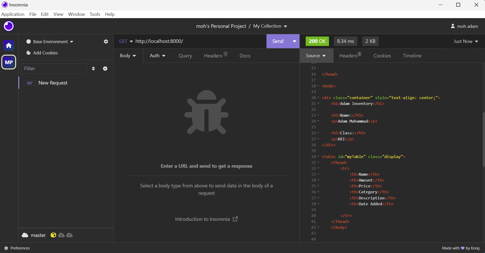
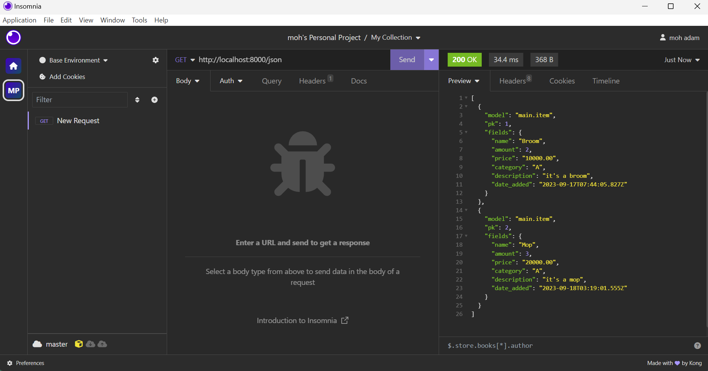
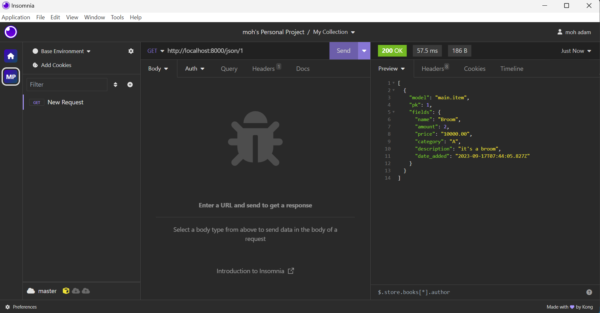
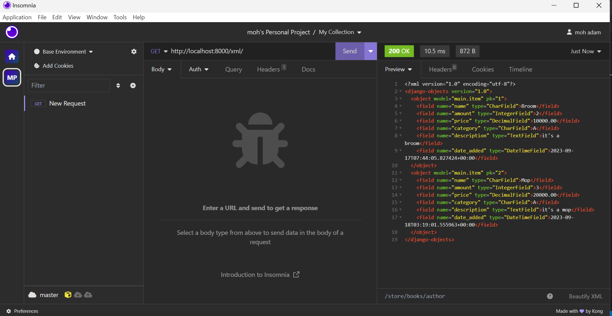
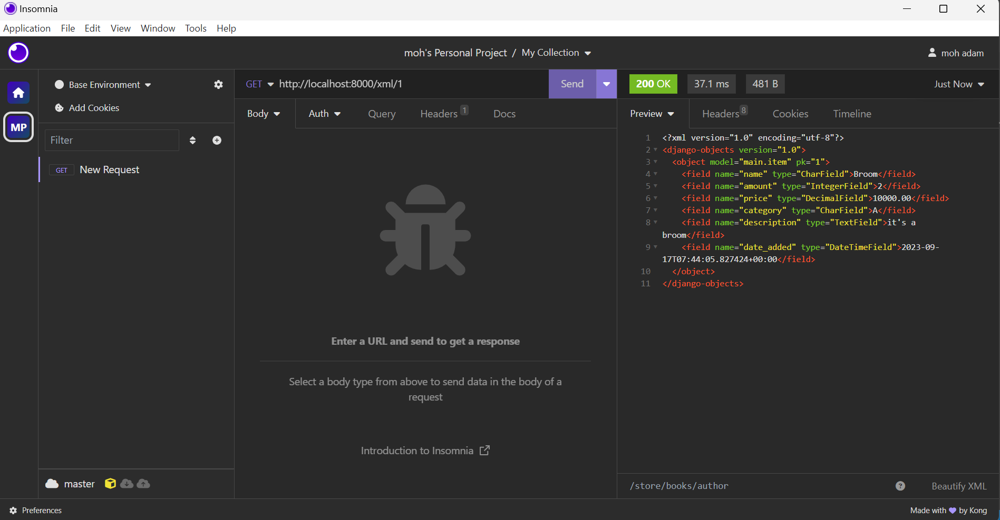

### Assignment 2

Link to the app -> [Click Here!](https://adam-inventory.adaptable.app/main/)

## Questions:
### 1. Create a new Django Project
1. Create a new Django Project
    - First we need to create a virtual environment by executing the following command:
    ```
    python -m venv env
    ```
2. After that we need to activate the virtual environment by executing the following command:
    - Windows
    ```
    env\Scripts\activate.bat
    ```
    - Mac OS
    ```
    source env/bin/activate
    ```
3. Create a `requirements.txt` in the project directory to install all the dependencies that are needed

4. To install all the dependencies to the virtual environment is by running this command:
	```
	py -m pip install requirements.txt
	```

5. Last but not least, try to run the project by running the following command:
	```
	django-admin startproject Assignment2 .
	```

### 2. Create an app with the name main.
1. Create a new Django App
    ```
    py manage.py startapp main
    ```
2. Create a directory named templates in the main app, and then create a file named main.html

3. Add a simple code to the main.html file with this following code:
   ```
   <h1>{{ appname }}</h1>

    <h5>Name:</h5>
    <p>{{ name }}</p>

    <h5>Class:</h5>
    <p>{{ class }}</p>
   ```

4. Add this method the views.py to  fill all the variables that are in the main.html file(appname, name, class)
    ```
    def show_main(request):
    context = {
        'appname': 'Adam Inventory',
        'name': 'Adam Muhammad',
        'class': 'KKI'
    }

    return render(request, 'main.html', context)
    ```

### 3. Create a URL routing configuration to access the main app.
1. Edit `urls.py` in the main app to configure the routing with this configuration:
    ```
    from django.urls import path
    from main.views import show_main

    app_name = 'main'

    urlpatterns = [
        path('', show_main, name='show_main'),
    ]
    ```
2. Configure app routes to the main project
    - edit `urls.py` in Assignment2(project directory) with this code:
    ```
    from django.contrib import admin
    from django.urls import path, include

    urlpatterns = [
        path('admin/', admin.site.urls),
        path('main/', include('main.urls')),
    ]
    ```
3. Register the app to the project by editting the `settings.py` file in Django project directory:
    - add the app name to **INSTALLED_APPS** variable, the code will be look like this:
        ```
        INSTALLED_APPS = [
            ...
            'main',
            ]
        ```
    - edit **ALLOWED_HOSTS** variable to:
        ```
        ALLOWED_HOSTS = ["*"]
        ```
      as a development purpose only we allow all the host to access the website
### 4. Create a model in main app
1. Add the mandatory attributes such as name with ChardField data type, amount with IntegerField data type, description with TextField data type, and additional attributes, the code should look like this:
    ```
    from django.db import models

    class Item(models.Model):
        name = models.CharField(max_length=255)
        amount = models.IntegerField()
        price = models.DecimalField(max_digits=19, decimal_places=2)
        category = models.TextField()
        description = models.TextField()
    ```
### 5. Diagram Flow.


First, user make a request to Django-Based website, and then it will trigger `urls.py` to find wich route that user want to access for example, if user make a request with a route(url) `localhost:8000/main` then after that it will trigger the `views.py` to find wich method that routes associated, after that render the html file and `views.py` could be communicate with `models.py` if the html file needs any data to be rendered. After `models.py` communicate with Database then the models return the data to `views.py` and display it to html file that was requested.


### 6. Purpose of a virtual environment, can we create a Django web app without a virtual environment?
A virtual environment in the context of Python is a self-contained directory that contains its own Python interpreter and a set of libraries. Its primary purpose is to isolate Python projects and their dependencies, ensuring that each project has its own clean and independent environment. Regarding Django web apps: While it is technically possible to create a Django web app without a virtual environment, it is highly discouraged for the reasons mentioned above. Django projects often rely on specific versions of Django and other Python packages, and using a virtual environment ensures that you can manage these dependencies without interfering with other Python projects on your system.

### 7. What is MVC, MVT, and MVVM? Explain the differences between the three.
MVC (Model-View-Controller), MVT (Model-View-Template), and MVVM (Model-View-ViewModel) are architectural patterns used in software development to structure the code and separate concerns in an application.
While they share some similarities, they have distinct differences in how they organize and manage the components of an application:
#### 1. MVC (Model-View-Controller):
- Model: Represents the application's data and business logic. It encapsulates the data and defines how it can be accessed and manipulated.
- View: Responsible for displaying the data to the user. It presents the information and interacts with the user interface.
- Controller: Acts as an intermediary between the Model and the View. It receives user input from the View, processes it, and updates the Model or the View accordingly. It handles the application's flow and logic.

**Differences**
- MVC is typically associated with traditional server-side web applications, desktop applications, and GUI frameworks.
- The Controller plays a central role in managing user input and application flow.
- MVC does not prescribe a specific template engine for rendering views.

#### 2. MVT (Model-View-Template):
- Model: Similar to MVC, it represents the application's data and business logic.
- View: In MVT, the View is responsible for defining how data is presented to the user. However, in some frameworks like Django (a Python web framework), the View also handles some of the controller's responsibilities.
- Template: The Template in MVT is responsible for defining the structure and layout of the user interface. It specifies how data should be displayed but doesn't contain application logic.

**Differences**
- MVT is closely associated with web frameworks like Django and Ruby on Rails, where the Template system is a key part of rendering web pages.
- The Template separates the presentation logic from the View and is focused on defining the HTML structure.
- In some MVT frameworks like Django, the View includes routing and some controller-like functionality.

#### 3. MVVM (Model-View-ViewModel):
- Model: Represents the application's data and business logic, similar to MVC and MVT.
- View: Represents the user interface, just like in MVC and MVT.
- ViewModel: Sits between the View and the Model. It contains the presentation logic and exposes data and commands that the View can bind to. The ViewModel is responsible for transforming and formatting the data for display.

**Differences**
- MVVM is commonly used in client-side application development, especially with frameworks like Angular.
- The ViewModel is the central component in MVVM, separating the View from the Model and containing most of the presentation logic.
- Data binding is a key concept in MVVM, allowing automatic synchronization between the ViewModel and the View.


### Assignment 3
<details>
<summary>1. POST form and GET form in Django</summary>

In Django, there are two common HTTP methods for submitting data from a web form to a server: POST and GET. These methods have different purposes and behaviors:
#### 1. POST Form:
- Purpose: The POST method is primarily used for submitting data to the server to create or modify a resource on the server. It is often used for actions that have side effects, such as submitting a contact form, creating a new user account, or updating a database record.

- Security: Data submitted via POST is included in the request body rather than in the URL, making it more secure for sensitive information like passwords because it's not visible in the browser's address bar.
- Data Length: POST requests can carry a larger amount of data compared to GET requests, which are limited in the amount of data they can send.

In Django, to handle POST requests in a view by checking `request.method == 'POST'` and processing the submitted form data.


#### 2. GET Form:
- Purpose: The GET method is primarily used for retrieving data from the server, typically used for search queries, filtering, or fetching information. It is intended for safe and idempotent operations, meaning it should not have side effects on the server.

- Visibility: Data submitted via GET is included in the URL as query parameters. This makes it visible in the browser's address bar, which can be a privacy concern for sensitive information.

- Data Length: GET requests have limitations on the length of the URL and the amount of data that can be sent. Complex or large forms with many fields should generally use POST.

In Django, to access GET parameters using `request.GET` in a view.
</details>

<details>
<summary>2. Differences between XML, JSON, and HTML in the context of data delivery</summary>

XML (eXtensible Markup Language), JSON (JavaScript Object Notation), and HTML (Hypertext Markup Language) are all used for data delivery and representation, but they serve different purposes and have distinct characteristics in this context:

### 1.XML (eXtensible Markup Language):
- Structure: XML is a markup language that uses tags to define and structure data. It is highly customizable, and you can create your own XML schema to represent data in a specific format.

- Data Description: XML is primarily used for describing and structuring data. It does not prescribe any particular data types or behaviors, so it's very flexible.

- Readability: XML is human-readable, but it tends to be more verbose compared to JSON, which can make it less efficient for large data payloads.

### 2.JSON (JavaScript Object Notation):
- Structure: JSON is a lightweight data interchange format that represents data as key-value pairs or arrays. It is commonly used in web applications for data transfer.

- Data Description: JSON is well-suited for representing structured data and is often used for configuration files, APIs, and data exchange between a server and a client.

- Readability: JSON is more concise and easier to read compared to XML, especially for complex data structures.

### 3.HTML (Hypertext Markup Language):
-  HTML, on the other hand, is designed for creating web pages with a focus on presentation and interactivity, and it is not typically used for data interchange in the same way as XML and JSON.
</details>

<details>
<summary>3. JSON often used in data exchange between modern web applications</summary>
As i mentioned before JSON is lightweight, Human-Readable, and JSON has a simple and concise syntax that is easy for both humans and machines to read and write. Its minimalistic structure makes it efficient for transmitting data over networks, reducing the amount of overhead compared to more verbose formats like XML.

</details>

<details>
<summary>4. step-by-step adding HTML, XML, JSON, XML by ID, and JSON by ID</summary>

### 1. Create `forms.py` in `main` folder, and fill with the following code:
```
from django.forms import ModelForm
from main.models import Item

class ItemForm(ModelForm):
    class Meta:
        model = Item
        fields = [
            "name",
            "amount",
            "price",
            "category",
            "description",
            ]
```
this code is used to create a simple form to input new data.

### 2.  Create a method named `create_product` and rest of method `HTML, XML, JSON, XML by ID, and JSON by ID` in `views.py`

```
def create_product(request):
    form = ItemForm(request.POST or None)

    if form.is_valid() and request.method == "POST":
        form.save()
        return HttpResponseRedirect(reverse('main:show_main'))

    context = {'form': form}
    return render(request, "create_product.html", context)

def show_xml(request):
    data = Item.objects.all()
    return HttpResponse(serializers.serialize("xml", data), content_type="application/xml")

def show_json(request):
    data = Item.objects.all()
    return HttpResponse(serializers.serialize("json", data), content_type="application/json")

def show_xml_by_id(request, id):
    data = Item.objects.filter(pk=id)
    return HttpResponse(serializers.serialize("xml", data), content_type="application/xml")

def show_json_by_id(request, id):
    data = Item.objects.filter(pk=id)
    return HttpResponse(serializers.serialize("json", data), content_type="application/json")
```

### 3. Configure the router in `urls.py` for each of the views:
```
#...
urlpatterns = [
    path('', show_main, name='show_main'),
    path('create-product', create_product, name='create_product'),
    path('xml/', show_xml, name='show_xml'),
    path('json/', show_json, name='show_json'),
    path('xml/<int:id>/', show_xml_by_id, name='show_xml_by_id'),
    path('json/<int:id>/', show_json_by_id, name='show_json_by_id'), 
]
```

</details>

<details>
<summary>5. Screenshots of the result</summary>

### 1. HTML


### 2. JSON


### 3. JSON by Id


### 4. XML


### 4. XML by Id

</details>